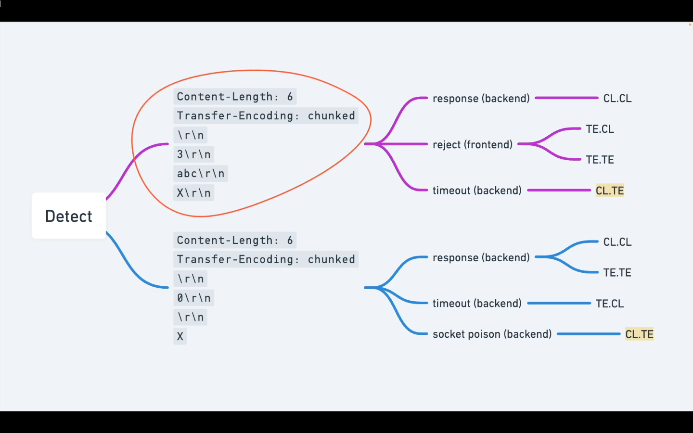
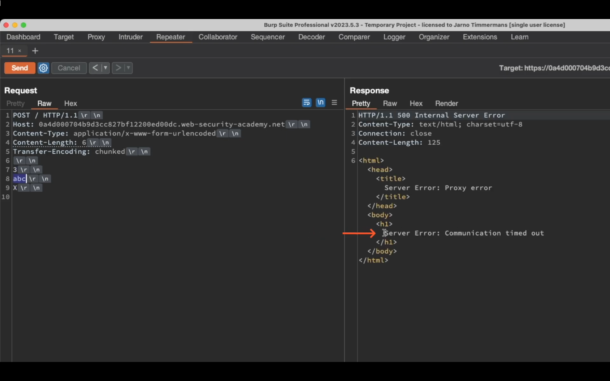
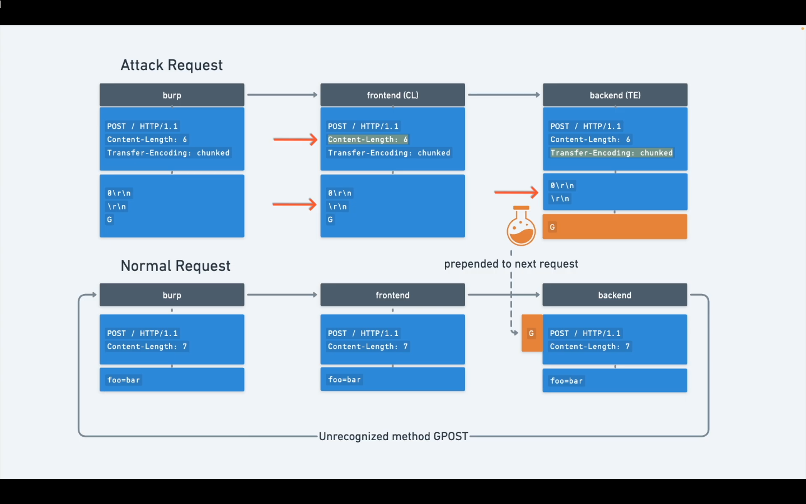
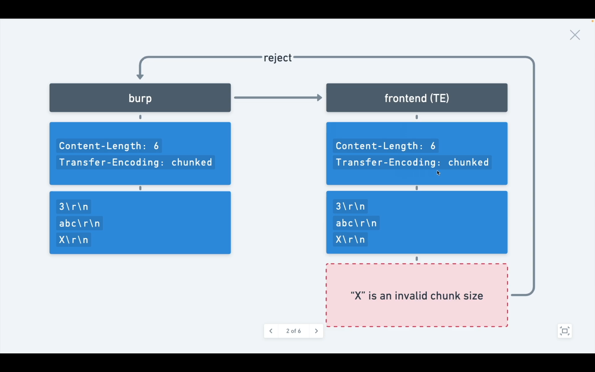

# CL.TE Request Smuggling Vulnerability

## 🎯 Overview

**CL.TE (Content-Length → Transfer-Encoding)** is a type of HTTP request smuggling vulnerability that occurs when:

- The **frontend server** uses `Content-Length` to parse the request
- The **backend server** uses `Transfer-Encoding: chunked` to parse the same request

This mismatch causes **request desynchronization**.

---

## 🧠 Core Idea

> Different servers trust different headers to determine where a request ends.

As a result:

- Part of the request body is interpreted as a **new HTTP request** by the backend
- This allows attackers to **smuggle hidden requests**

---

## 🧩 How CL.TE Works (High Level)

### Frontend Behavior

- Trusts `Content-Length`
- Reads only the number of bytes specified
- Forwards remaining bytes to backend as-is

### Backend Behavior

- Ignores `Content-Length`
- Trusts `Transfer-Encoding: chunked`
- Decodes chunks and continues parsing

➡️ Result: **Frontend and backend disagree on request boundaries**

---

## 🧪 Example Vulnerable Request

```http
POST / HTTP/1.1
Host: vulnerable-site.com
Content-Length: 4
Transfer-Encoding: chunked

0

GET /admin HTTP/1.1
Host: vulnerable-site.com
```

### Preparations


1. PIck an end point (root)
2. Downgrade HTTP
3. DIsable Update content length
4. Change The request method to post
5. Turn on unprintable charactors
   
   
   
   
   

### TE.CL vulnerabilities
Here, the front-end server uses the Transfer-Encoding header and the back-end server uses the Content-Length header. We can perform a simple HTTP request smuggling attack as follows:
```http
POST / HTTP/1.1
Host: vulnerable-website.com
Content-Length: 3
Transfer-Encoding: chunked

8
SMUGGLED
0
```

>Note
**To send this request using Burp Repeater, you will first need to go to the Repeater menu and ensure that the "Update Content-Length" option is unchecked.**

You need to include the trailing sequence \r\n\r\n following the final 0.

**The front-end server processes the Transfer-Encoding header, and so treats the message body as using chunked encoding. It processes the first chunk, which is stated to be 8 bytes long, up to the start of the line following SMUGGLED. It processes the second chunk, which is stated to be zero length, and so is treated as terminating the request. This request is forwarded on to the back-end server.**

**The back-end server processes the Content-Length header and determines that the request body is 3 bytes long, up to the start of the line following 8. The following bytes, starting with SMUGGLED, are left unprocessed, and the back-end server will treat these as being the start of the next request in the sequence.**


