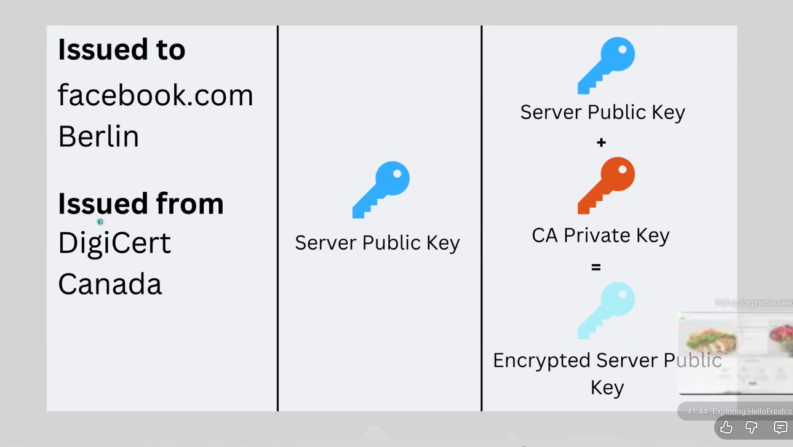
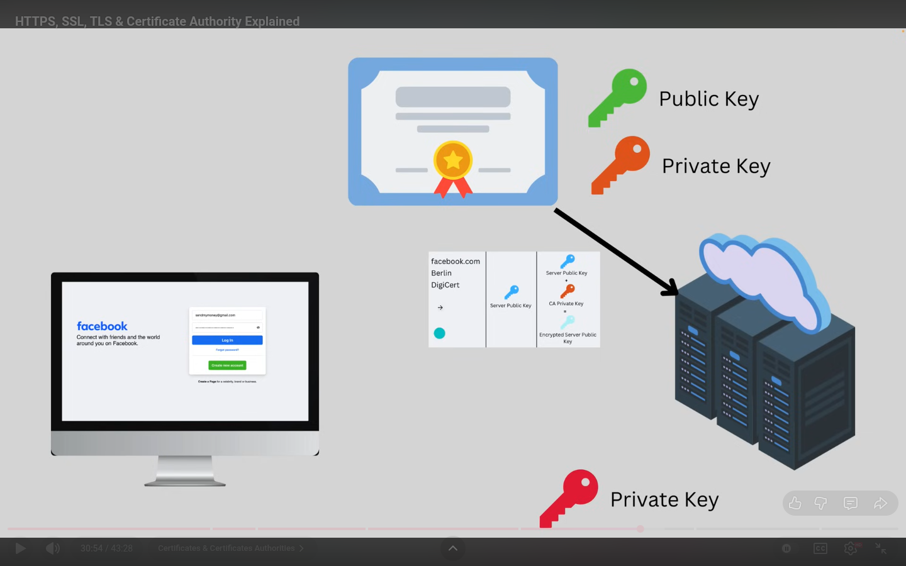
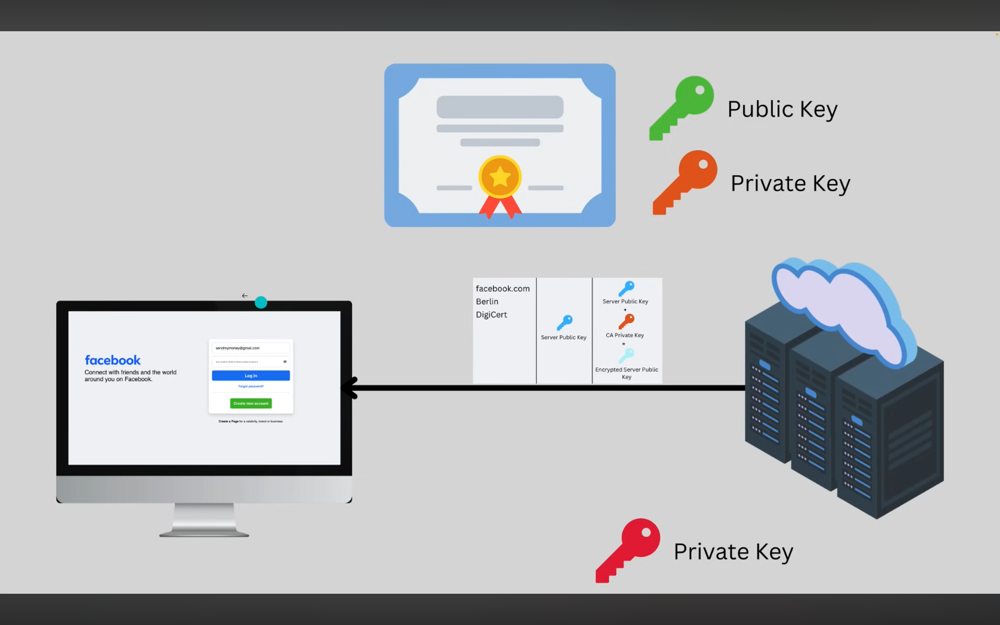
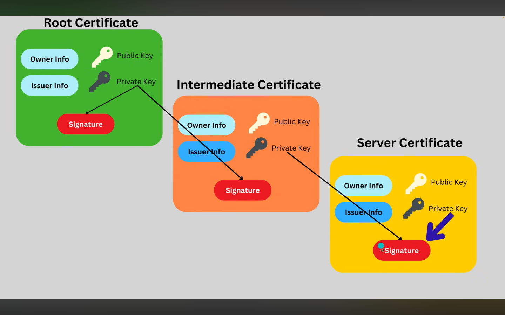

# 🗓️ Day 7 — HTTPS AND TLS

## 🎯 Goal

> Understand how HTTPS/TLS secures communication, what it protects (and doesn’t), how certificates work, and how attacks like MITM happen.

---

## 🔐 Core Concepts

HTTP is not secure

Data is sent in plain text

Anyone on the network can read, modify, or steal it
-For encryption a key(Random letters and numbers) is needed

> AES256 encryption algorithm is mostly used
> -Fast

-Symmetric

-Used for actual data transfer after TLS handshake
-Public key → shared with everyone

-Private key → kept secret by the server

-Data encrypted with public key can only be decrypted with private key

> - -Here there are two keys eg:Public key and Private key. The same key is not used to decrypt data

### What it protects

-🔐 Confidentiality – attackers can’t read data

-🧾 Integrity – data can’t be modified in transit

-🧍 Authentication – you know you’re talking to the real server

### What it does NOT protect

❌ Server-side vulnerabilities (SQLi, XSS, RCE)

❌ Malicious users with valid credentials

❌ Malware already on the user’s device

## 🧠 Key Definitions

- **Symmetric encryption**: using the same encryption key to encrypt and decrypt the same data
- Eg AES

- **Asymmetric encryption**:
- Uses two keys (public & private)

-Slower

-Used for key exchange, not bulk data
**TLS**:

-Protocol that:

-Authenticates servers

-Exchanges keys securely

-Encrypts communication

## 📜 Certificates & Trust

> A certificate is issued by a trusted third party (CA) and proves the server’s identity.

Certificate contains:

-Public key

-Identity info

> Private key is never shared

### 📄 Certificate Purpose

-Prove the server is who it claims to be

-Prevent MITM attacks

-Enable secure key exchange

> Is a third party entity trusted by the browser
> -It has both public and private

What the cert entails

### Certificate Chain

> Certificate Chain

-Root CA

-Trusted by OS/browser

-Self-signed

> Intermediate CA

-Issued by Root

-Issues server certs

> Server Certificate

-Issued to the website

-Used during TLS handshake

- Root CA:
- Intermediate CA:
- Server Cert:

### Important Fields

> CN / SAN:

- Domain names the cert is valid for
  > Validity:
- Start & expiry dates
  > Public Key:
  > -Used by clients to encrypt data

---

## 🤝 Protocol Flow (High Level)

1.Client says: “Hey, I want HTTPS”
2.Server sends certificate (with public key)
3.Client verifies certificate using CA chain
4.Secure session key is created → encrypted communication starts

> 🧠 Mental model / analogy:
> TLS is like:

Checking an ID card (certificate)

Using a lockbox (public key) to send a secret

> Switching to a private phone call (AES session key)

## 🕵️ Attack Concepts

> MITM (Man-in-the-Middle)

**What it is**

-Attacker secretly intercepts communication

**When it works**

-HTTP

-Invalid certificates

-User ignores browser warnings

**When it fails**

-Proper HTTPS

-Valid certificates

-Certificate pinning

### Common Mistakes

-Ignoring certificate warnings

-Assuming HTTPS = secure application

## 🧪 Hands-On / Lab Notes

### Tool Used

-Burp Suite

-Browser DevTools

### Setup Steps

1.Visit HTTP vs HTTPS site
2.Inspect certificate in browser
3.Intercept traffic using Burp

### What I Observed

-HTTP traffic is readable
-HTTPS traffic is encrypted
-Certificate details show CA trust chain

## ⚠️ Security Takeaways

-
-
- ***

## ❌ Myths & Misconceptions

| Myth               | Reality                         |
| ------------------ | ------------------------------- | ----------------- |
| HTTPS = Secure App | HTTPS only secures transport    |
|                    | Identity still must be verified | Encryption = Auth |

---

## 🧠 Exam / Interview Notes

-TLS uses asymmetric encryption to exchange symmetric keys

-Certificates establish trust

-HTTPS protects data in transit only

## 🧩 Real-World Examples

-Login forms

-Online banking

-API authentication

-OAuth token exchange

## 📝 Questions I Still Have

-How does certificate pinning work?

-How do TLS downgrades happen?

## 🔁 Quick Summary

> HTTPS uses TLS to authenticate servers, exchange keys securely, and encrypt data in transit using symmetric encryption.

---

## 📚 Resources (Videos / Labs)

-Computerphile – HTTPS explained

-LiveOverflow – TLS basics

-PortSwigger TLS Academy

## ⭐ Confidence Level

- [ ] Still confused
- [ ] Mostly clear
- [ ] Can explain it to someone else
